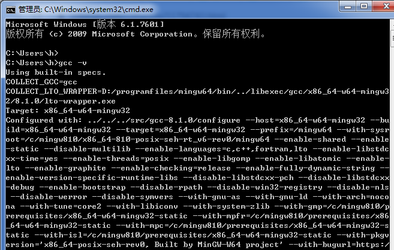
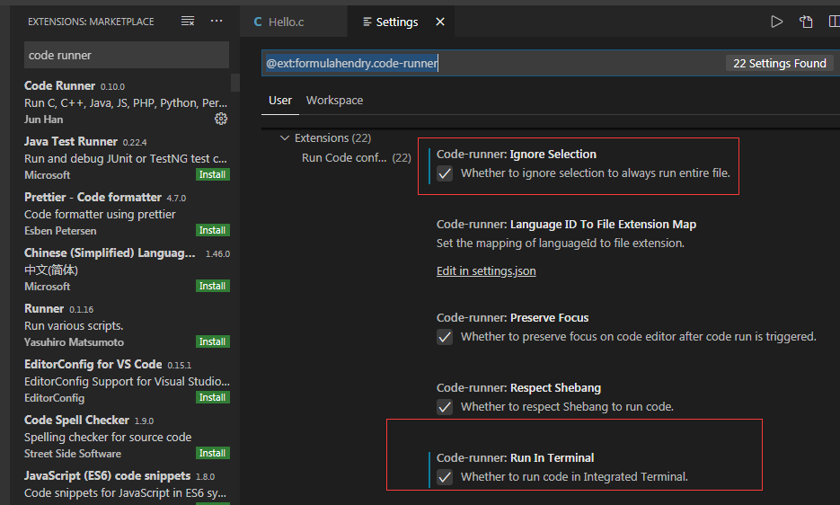
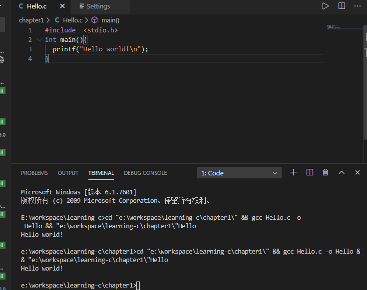
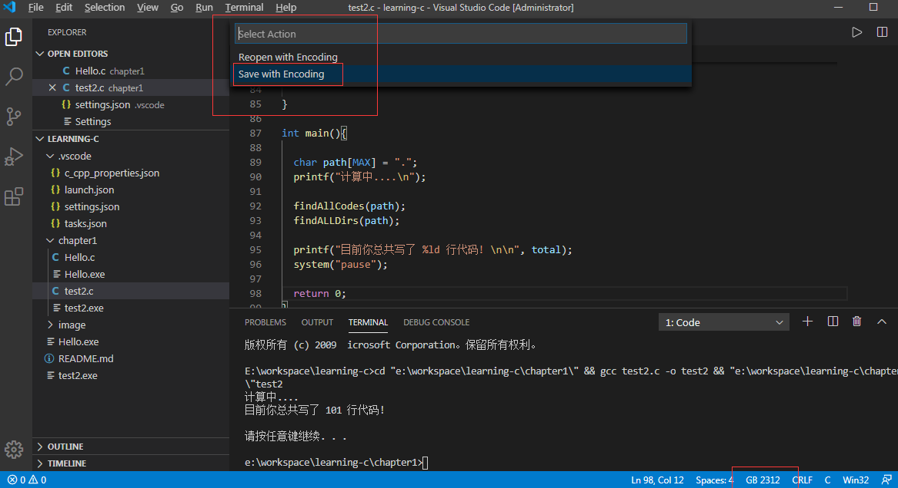
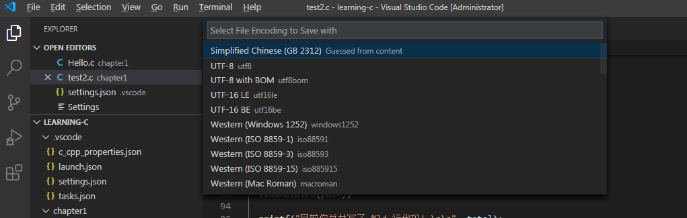

#  C语言基础学习

##### 1、在windows上 学习c语言

  (1)  java 在windows上学习C语言,这里使用vscode来进行学习, 首先需要下载MinGw，并且配置环境变量。

因为windows下vscode不直接具备对于C语言的编译调试工具，所以要下载集成gcc等工具的MinGw以提供扩展支持。

  MinGw下载地址 https://sourceforge.net/projects/mingw-w64/files/

 (2)、MinGw下载好了之后,配置系统环境变量, 在环境变量path路径下加入 这个MinGw的安装路径D:\programfiles\mingw64\bin。 然后在新建系统环境变量名为include , 值为D:\programfiles\mingw64\include； 最后在使用cmd中使用gcc -v 命令来验证是否安装成功。





在vscod中 ,扩展中输入code runder 然后点击设置图标进行设置




写一个简单的打印程序,可以看到已经有语句输出了




按F5键,选择 C++（GDB）, 然后选择默认配置,会在工作目录中生成一个launch.json启动配置文件, 我们对这个进行修改，修改后的配置文件如下

```
{
    // Use IntelliSense to learn about possible attributes.
    // Hover to view descriptions of existing attributes.
    // For more information, visit: https://go.microsoft.com/fwlink/?linkid=830387
    "version": "0.2.0",
    "configurations": [
        {
            "name": "(gdb) Launch",// 配置名称，将会在启动配置的下拉菜单中显示
            "type": "cppdbg",    // 配置类型，这里只能为cppdbg
            "request": "launch", // 请求配置类型，可以为launch（启动）或attach（附加）
            "program": "${workspaceFolder}/${fileBasenameNoExtension}.exe",
             // 将要进行调试的程序的路径  
             
            "args": [], // 程序调试时传递给程序的命令行参数，一般设为空即可  
            "stopAtEntry": false, // 设为true时程序将暂停在程序入口处，一般设置为false  
            "cwd": "${workspaceFolder}", 
            // 调试程序时的工作目录，一般为${workspaceFolder}即代码所在目录  
            "environment": [],
            "externalConsole": true, // 调试时是否显示控制台窗口，一般设置为true显示控制台 
            "preLaunchTask": "gcc", // 调试会话开始前执行的任务，一般为编译程序，c++为g++, c为gcc  
            "MIMode": "gdb",
            "miDebuggerPath": "D:\\programfiles\\mingw64\\bin\\gdb.exe", 
            // miDebugger的路径，注意这里要与MinGw的路径对应 
            "setupCommands": [
                {
                    "description": "Eable pretty-printing for gdb", //为 gdb 启用整齐打印
                    "text": "-enable-pretty-printing",
                    "ignoreFailures": true
                }
            ]
        }
    ]
}
```


修改Teminal (终端)输出乱码问题, 在vscode中选择 右下角编码方式,然后 选择通过编码保存(save with Encoding)

这个来选这编码方式, 这里选择 GB2312 ，然后再次运行可以看到 Teminal 没有乱码了







Ctrl+Shift+P输入Tasks:Configure Task配置任务，选择使用模块创建task.json文件，选择Others模板，生成task.json文件，修改如下：

https://www.cnblogs.com/biangbiangmian/p/10305779.html